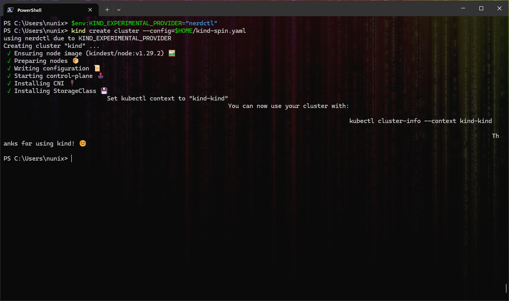
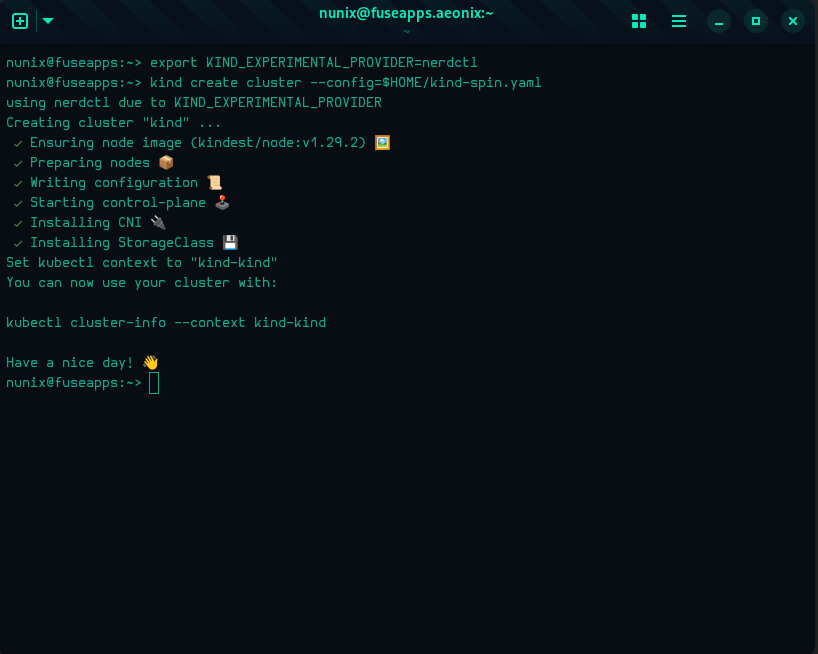

The goal of this guide is show a way to bring [SpinKube](https://www.spinkube.dev/) to [KinD](https://kind.sigs.k8s.io/) without the need of a custom image, like the [SpinKube on k3d](https://www.spinkube.dev/docs/spin-operator/quickstart/) example.

Instead, the Rancher Desktop (RD) Spin plugin will be used alongside KinD cluster configuration.

Finally, this guide will have three major sections covering the following:

- KinD configurations: contains the different configurations, depending on your OS
- RD on WSL: targets only Windows users
- RD on LIMA: targets both Linux and MacOS users

## Prerequisites

In order to follow this guide, the following applications need to be installed:

- Rancher Desktop v1.13
  - This is the first version with the Spin plugin
  - The following preferences are set:
    - Preferences > Container Engine
      - containerd is selected
      - Web Assembly (wasm) is enabled
    - Preferences > Kubernetes
      - Kubernetes is disabled
- KinD v0.23
  - This is the first version with the `nerdctl` provider
  - If not yet available, you might need to build it (see [Bonus 1: build KinD](#bonus-1-build-kind))

Concerning the Kubernetes tooling, Rancher Desktop already covers it.

### Connecting the Dots

The reason KinD v0.23 is needed with the `nerdctl` provider is because the Spin plugin only works on Rancher Desktop when `containerd` runtime is selected, instead of `docker`.

If it's still "obscure", keep reading and hopefully it will make sense (yes, not yet spoiling how the Spin plugin will be leveraged).

## KinD Configurations

This section should clarify how the Spin plugin will be leveraged.

### Containerd Configuration File

The first configuration is related to `containerd`, and more precisely, the one running inside the KinD container(s):

- Create a file in your `$HOME` directory called `config.toml`
  - You can create it inside a directory, however it still should be located in your `$HOME` directory
  - The location will be important when creating the KinD cluster
- Paste the following content inside the `config.toml` file:

```toml
# explicitly use v2 config format
version = 2

[proxy_plugins]
# fuse-overlayfs is used for rootless
[proxy_plugins."fuse-overlayfs"]
  type = "snapshot"
  address = "/run/containerd-fuse-overlayfs.sock"

[plugins."io.containerd.grpc.v1.cri".containerd]
  # save disk space when using a single snapshotter
  discard_unpacked_layers = true
  # explicitly use default snapshotter so we can sed it in entrypoint
  snapshotter = "overlayfs"
  # explicit default here, as we're configuring it below
  default_runtime_name = "runc"
[plugins."io.containerd.grpc.v1.cri".containerd.runtimes.runc]
  # set default runtime handler to v2, which has a per-pod shim
  runtime_type = "io.containerd.runc.v2"
  # Generated by "ctr oci spec" and modified at base container to mount poduct_uuid
  base_runtime_spec = "/etc/containerd/cri-base.json"
  [plugins."io.containerd.grpc.v1.cri".containerd.runtimes.runc.options]
    # use systemd cgroup by default
    SystemdCgroup = true

# Setup a runtime with the magic name ("test-handler") used for Kubernetes
# runtime class tests ...
[plugins."io.containerd.grpc.v1.cri".containerd.runtimes.test-handler]
  # same settings as runc
  runtime_type = "io.containerd.runc.v2"
  base_runtime_spec = "/etc/containerd/cri-base.json"
  [plugins."io.containerd.grpc.v1.cri".containerd.runtimes.test-handler.options]
    SystemdCgroup = true

[plugins."io.containerd.grpc.v1.cri"]
  # use fixed sandbox image
  sandbox_image = "registry.k8s.io/pause:3.7"
  # allow hugepages controller to be missing
  # see https://github.com/containerd/cri/pull/1501
  tolerate_missing_hugepages_controller = true
  # restrict_oom_score_adj needs to be true when running inside UserNS (rootless)
  restrict_oom_score_adj = false
  
[plugins."io.containerd.grpc.v1.cri".containerd.runtimes.spin]
  runtime_type = "/usr/local/bin/containerd-shim-spin-v2"

```

> NOTE: this file is a copy of the original one that can be found inside the KinD container. The only addition to the file is the declaration of the `spin` plugin (the last 2 lines)

### KinD Configuration File

The second configuration file is related to KinD and will be used when creating a new cluster:

- Create a file in your `$HOME` directory called `kind-spin.yaml` (for example)
  - You can create it inside a directory, however it still should be located in your `$HOME` directory
  - The location will be important when creating the KinD cluster

**Windows Users ONLY**

```yaml
@"
kind: Cluster
apiVersion: kind.x-k8s.io/v1alpha4
nodes:
- role: control-plane
  extraMounts:
  - hostPath: /root/kind-spin/config.toml
    containerPath: /etc/containerd/config.toml
  - hostPath: /usr/local/containerd-shims/containerd-shim-spin-v2
    containerPath: /usr/local/bin/containerd-shim-spin-v2
"@ | rdctl shell -- tee -a /root/kind-spin.yaml
```

**Linux and MacOS Users ONLY**

```yaml
cat <<EOF > $HOME/kind-spin.yaml
kind: Cluster
apiVersion: kind.x-k8s.io/v1alpha4
nodes:
- role: control-plane
  extraMounts:
  - hostPath: ${HOME}/config.toml
    containerPath: /etc/containerd/config.toml
  - hostPath: /usr/local/containerd-shims/containerd-shim-spin-v2
    containerPath: /usr/local/bin/containerd-shim-spin-v2
EOF
```

#### Connecting the Dots (Two)

Rancher Desktop leverages two different technologies depending on the OS its installed.

On Windows, [WSL2](https://learn.microsoft.com/en-us/windows/wsl/install) will be used and for Linux and MacOS, [Lima](https://lima-vm.io/docs/) is the preferred choice.

While both technologies run Linux in a microVM, the behaviors differ in some parts. And the mountpoints with the host system are one of these differences.

In the case of RD on WSL, the file generated is created **inside** the microVM, as nerdctl will need to have acceess to the file's path. Technically speaking, the mountpoint `/mnt/c` could also be used, however sometimes it's not available due to WSL main configuration. This way should be a bit more generic.

Concerning RD on Lima, `$HOME` is mounted inside the microVM, therefore nerdctl will already see the files, and there's not need on copying the files over like it's done for WSL.

Finally, on both cases, the binary `containerd-shim-spin-v2` is already accessible inside the microVMs.

## Create KinD Cluster

With all the preparations done, you can now create a new KinD cluster as follows:

**Windows Users ONLY**

```powershell
# Set the KinD provider to nerdctl
$env:KIND_EXPERIMENTAL_PROVIDER="nerdctl"

# Create a new cluster with the config file "kind-spin.yaml"
kind create cluster --config=$HOME/kind-spin.yaml
```



**Linux and MacOS Users ONLY**

```bash
# Set the KinD provider to nerdctl
export KIND_EXPERIMENTAL_PROVIDER=nerdctl

# Create a new cluster with the config file "kind-spin.yaml"
kind create cluster --config=$HOME/kind-spin.yaml
```



Now that you have a KinD cluster running with the spin plugin enabled for `containerd`. However, it is not yet used by Kubernetes (`runtimeClass`). This will be done on the next section.

## Deploy SpinKube

From here, you can reference the [excellent quickstart to deploy SpinKube](https://www.spinkube.dev/docs/spin-operator/quickstart/) for a detailed explanation of each step.

To avoid repetition, and to encourage you to go read the quickstart (and the overall SpinKube docs), the steps below will only include short descriptions:

>  **IMPORTANT:** the following commands are "universal", working on both powershell and bash/zsh. The "multiline characters" have been removed on purpose (\` for powershell and \\ for bash).

```shell
# Install cert-manager
kubectl apply -f https://github.com/cert-manager/cert-manager/releases/download/v1.14.3/cert-manager.yaml

# Install the Runtime Class
kubectl apply -f https://github.com/spinkube/spin-operator/releases/download/v0.1.0/spin-operator.runtime-class.yaml

# Install the CRD
kubectl apply -f https://github.com/spinkube/spin-operator/releases/download/v0.1.0/spin-operator.crds.yaml

# Deploy SpinKube
helm install spin-operator --namespace spin-operator --create-namespace --version 0.1.0 --wait oci://ghcr.io/spinkube/charts/spin-operator

# Install the App Executor
kubectl apply -f https://github.com/spinkube/spin-operator/releases/download/v0.1.0/spin-operator.shim-executor.yaml
```

SpinKube is now deployed and you can run your first application as described below.

### Sample application

Same as the SpinKube deployment, you can follow the quickstart:

```shell
# Deploy the application
kubectl apply -f https://raw.githubusercontent.com/spinkube/spin-operator/main/config/samples/simple.yaml

# Port forwarding
kubectl port-forward svc/simple-spinapp 8083:80

# Open a webpage at http://localhost:8083/hello
## Or use curl
curl localhost:8083/hello
```


Congratulations! You have a cluster with SpinKube running.

## Conclusion

First of all, THANK YOU to all the projects maintainers and contributors! Without you, there wouldn't be blogs like this one.

Secondly, as you may know or not, this is **highly experimental**, and the main purpose was more a proof-of-concept rather than a real solution.

Lastly, SpinKube on Rancher Desktop has been tested, both by Fermyon and SUSE, and it's suggested that you [follow this howto](https://www.spinkube.dev/docs/spin-operator/tutorials/integrating-with-rancher-desktop/) for a long-term environment.

Special thanks to Fermyon for hosting this (first) blog on SpinKube and thanks to anyone reaching this last line, you mean the world to me.

> \>>> The Corsair <<<

## Bonus 1: build KinD

If you need to build the latest version of KinD, you can follow the steps below:

### [Optional] Non-intrusive and containerized binaries

Assuming you're already running Rancher Desktop, you can create the "binary shortcuts" as follows:

***Windows Users ONLY***

```powershell
# Function for GIT with your Windows user home directory mounted
## The Chainguard image is used for ease of use only
function git { nerdctl run --rm -v ${env:USERPROFILE}:/home/git chainguard/git $args}

# Function for GO with the current directory mounted and the GOOS environment variable set
## The Chainguard image is used for ease of use only
function go { nerdctl run --rm -v ${PWD}:/work -w /work -e GOOS=${env:GOOS} chainguard/go $args }
```

***Linux and MacOS Users ONLY***

```bash
# Function for GIT with your Linux user home directory mounted
## The Chainguard image is used for ease of use only
alias git='nerdctl run --rm -v $HOME:/home/git chainguard/git'

# Function for GO with the current directory mounted and the GOOS environment variable set
## The Chainguard image is used for ease of use only
alias go='nerdctl run --rm -v $PWD:/work -w /work -e GOOS=$GOOS chainguard/go'
```

### Build KinD

With both the `git` and `go` binaries available, you can now build KinD as follows:

***Windows Users ONLY***

```powershell
# Clone the KinD repository
git clone https://github.com/kubernetes-sigs/kind.git

# Change to the KinD directory
cd kind

# Build the KinD binary
$env:GOOS="windows"; go build -buildvcs=false -o kind.exe

# Move the binary to a directory in your PATH
mv kind.exe ${env:USERPROFILE}\bin

# Check the KinD version
kind version
```

***Linux and MacOS Users ONLY***

```bash
# Clone the KinD repository
git clone https://github.com/kubernetes-sigs/kind.git

# Change to the KinD directory
cd kind

# Build the KinD binary
go build -buildvcs=false -o kind

# Move the binary to a directory in your PATH
sudo mv kind /usr/local/bin

# Check the KinD version
kind version
```
