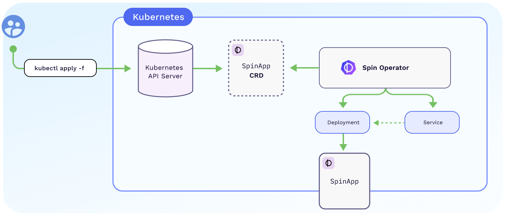

### What Is Spin Operator?

[Spin Operator](https://github.com/spinkube/spin-operator/) is a [Kubernetes operator](https://kubernetes.io/docs/concepts/extend-kubernetes/operator/) which empowers platform engineers to deploy [Spin applications](https://developer.fermyon.com/spin) as custom resources to their Kubernetes clusters. Spin Operator provides an elegant solution for platform engineers looking to improve efficiency without compromising on performance while maintaining workload portability. 

### Why Spin Operator? 

By bringing the power of the Spin framework to Kubernetes clusters, Spin Operator provides application developers and platform engineers with the best of both worlds. For developers, this means easily building portable serverless functions that leverage the power and performance of Wasm via the Spin developer tool. For platform engineers, this means using idiomatic Kubernetes primitives (secrets, autoscaling, etc.) and tooling to manage these workloads at scale in a production environment, improving their overall operational efficiency. 

### How Does Spin Operator Work? 

Built with the [kubebuilder](https://github.com/kubernetes-sigs/kubebuilder) framework, Spin Operator is a Kubernetes operator. Kubernetes operators are used to extend Kubernetes automation to new objects, defined as custom resources, without modifying the Kubernetes API. The Spin Operator is composed of two main components: 
- A controller that defines and manages Wasm workloads on k8s.
- The "SpinApps" Custom Resource Definition (CRD).  

SpinApps CRDs can be [composed manually](../glossary/_index.md/#custom-resource-definition-crd) or generated automatically from an existing Spin application using the [`spin kube scaffold`](../spin-plugin-kube/_index.md) command. The former approach lends itself well to CI/CD systems, whereas the latter is a better fit for local testing as part of a local developer workflow. 

Once an application deployment begins, Spin Operator handles scheduling the workload on the appropriate node (thanks to the [Runtime Class Manager](../runtime-class-manager/), previously known as Kwasm) and manages the resources lifecycle. No need to fetch the [containerd shim spin]((../containerd-shim-spin/) ) binary or mutate node labels. This is all managed via the Runtime Class Manager, which you will install as a dependency when setting up Spin Operator. 

## Next Steps

For application developers interested in writing their first Spin App, check out the [`spin kube` plugin](../spin-plugin-kube/) documentation. By the end of the quickstart, you'll have an application ready to deploy to your Kubernetes cluster of choice.

For platform engineers interested in cluster operations and working with Spin Operator, visit our [Spin Operator quickstart](./quickstart/_index.md). We provide you with a simple quickstart SpinApp to use alongside spin operator. 
